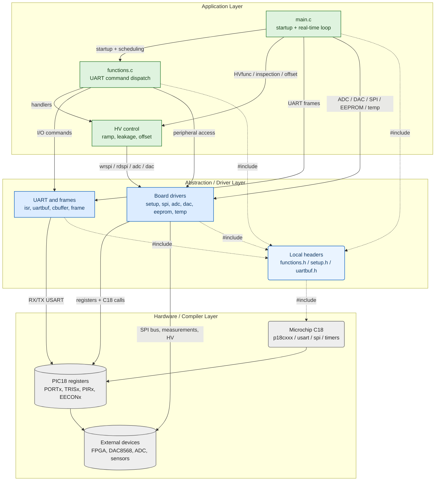
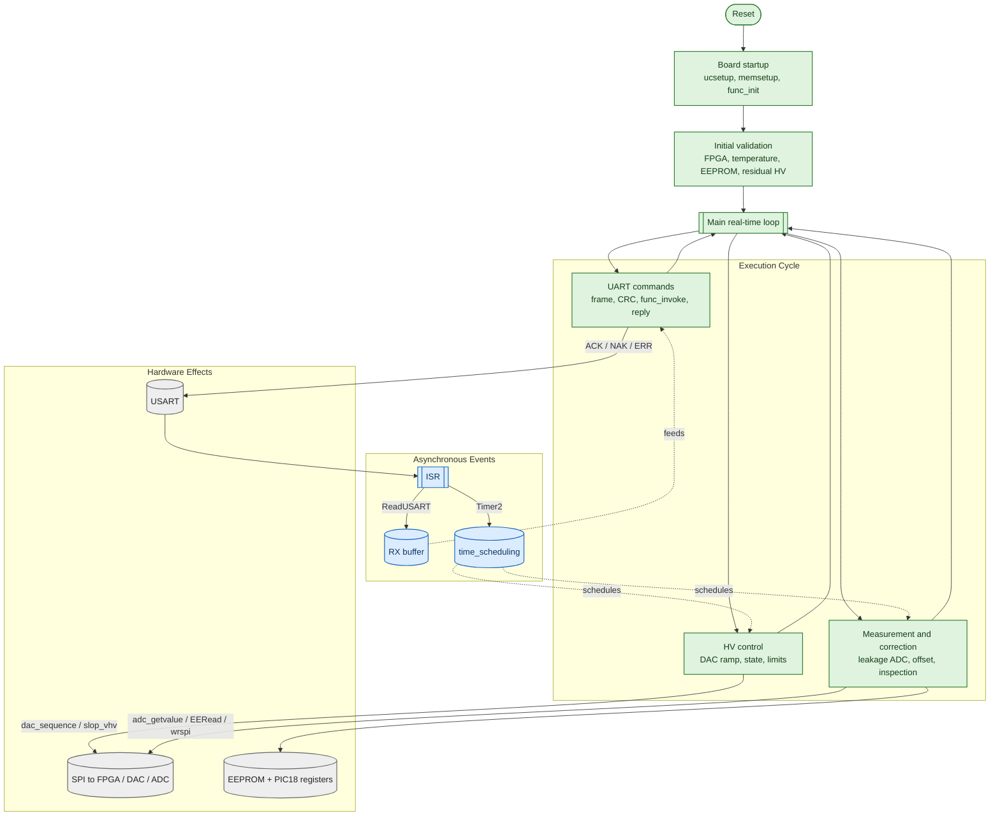

# FAZIA PIC V4 Firmware

This repository contains the MPLAB X firmware for the FAZIA PIC V4 board.
The target device is a PIC18F46K20 microcontroller.
The firmware configures the board peripherals, communicates with two FPGA devices, handles UART commands, and controls high-voltage modules.
It also manages temperature acquisition, ADC measurements, DAC outputs, EEPROM calibration data, and leakage-current correction.

## Technical Scope

- Target MCU: PIC18F46K20.
- Toolchain: MPLAB X with the Microchip C18 compiler family.
- Main entry point: `src/main.c`.
- Main communication interface: USART with framed commands.
- Main control domains: high voltage, leakage current, preamplifier offset, temperature, FPGA registers, and EEPROM calibration.
- Main hardware buses: SPI, USART, PIC internal ADC, timers, and internal EEPROM.

## Architecture Overview

The firmware follows a simple layered structure.
The application layer owns the main loop and the control algorithms.
The abstraction layer groups local drivers, frame handling, buffers, and board setup code.
The hardware layer is made of the C18 runtime headers, PIC18 registers, and external devices on the board.

Solid arrows show function calls or execution flow.
Dotted arrows show grouped `#include` dependencies.
Green nodes are application logic.
Blue nodes are local abstraction or driver code.
Grey nodes are compiler or hardware-level elements.
The diagram is intentionally compact so it can be exported as a readable image.

## Runtime Flow

At reset, the firmware configures the MCU and board state.
It then checks FPGA communication, validates temperature sensors, loads EEPROM parameters, and evaluates residual high voltage when enabled.
After this phase, the main loop runs continuously.
The loop processes UART commands and executes periodic control tasks driven by `time_scheduling`.

The interrupt service routine has two main roles.
It stores received USART bytes in the RX circular buffer.
It also increments `time_scheduling` from Timer2 events.
The main loop consumes this state and performs the heavier work.
This keeps the ISR short and reduces timing risk.

## Main Software Components

| Path | Role |
| --- | --- |
| `src/main.c` | Firmware entry point, startup sequence, UART loop, HV state machine, periodic inspection. |
| `src/functions.c` | UART command table and command handlers. |
| `src/isr.c` | USART receive interrupt and Timer2 scheduling tick. |
| `src/setup.c` | MCU ports, timers, USART, SPI, ADC, DAC, and board defaults. |
| `src/uartbuf.c` | UART RX/TX buffer handling. |
| `src/cbuffer.c` | Circular buffer implementation. |
| `src/frame.c` | Frame parsing, CRC calculation, and protocol field extraction. |
| `src/myfunc/spi.c` | SPI register access to FPGA devices. |
| `src/myfunc/dac8568.c` | DAC8568 control and high-voltage slope setup. |
| `src/myfunc/ads8332.c` | ADS8332 acquisition and leakage-current calculation. |
| `src/myfunc/analog.c` | PIC ADC and LTC2308 voltage measurements. |
| `src/myfunc/Tsensor.c` | Temperature sensor initialization and acquisition. |
| `src/myfunc/wr_eeprom.c` | EEPROM read/write and persistent parameter storage. |
| `src/myfunc/maths.c` | Numeric parsing and conversion helpers. |
| `src/myfunc/display.c` | Board ID and output formatting helpers. |

## High-Voltage Control

High-voltage control is centered on `HVfunc()` in `src/main.c`.
Each channel has a current DAC value, a target value, a slope increment, and a status flag.
When a channel is not stable, `HVfunc()` moves the DAC value toward the target in small steps.
The function writes the output through `dac_sequence()`.
Leakage-current inspection can request a new target through `slop_vhv()`.

The main state variables are:

- `HvValueTab[4][2]`: current and target DAC values.
- `HvInc[4]`: ramp increment for each channel.
- `HvStatus[4]`: channel state. A value of `1` means stable.
- `HvPhysTarget[4]`: requested physical high voltage.
- `HvPhysCorrect[4]`: corrected high voltage after leakage compensation.

## UART Command Path

The USART interrupt receives bytes and stores them in `Uart[SLAVE_RX]`.
The main loop scans this buffer with `cbuffer_large_getframe_length()`.
When a complete frame is found, it is decoded with the `frame_*` helpers.
The CRC and destination ID are checked before command execution.
Valid commands are dispatched by `func_invoke()` through the `fplist` table in `src/functions.c`.
The reply is sent as `ACK`, `NAK`, or `ERR` with a new CRC.

## Periodic Tasks

Timer2 increments `time_scheduling` in the ISR.
The main loop uses this counter to trigger periodic tasks.
These tasks include HV ramping, leakage-current calculation, preamplifier offset calibration, USART error recovery, and automatic HV correction.
The code uses small `done*` flags to avoid running the same task multiple times during one timer slot.

## Hardware Interfaces

- USART is used for framed host communication.
- SPI is used for FPGA register access, DAC control, and external ADC access.
- Timer1 is used by the temperature sensor code.
- Timer2 provides the main scheduling tick.
- Timer3 is configured for high-voltage related timing support.
- Internal EEPROM stores calibration and persistent parameters.
- PIC18 GPIO registers directly drive chip-select lines and control pins.

## Build Notes

This project is configured as an MPLAB X firmware project.
It expects the Microchip C18 toolchain and PIC18 headers.
The repository contains MPLAB project files under `nbproject/`.
Generated build outputs are placed under `build/` and `debug/`.
If the project was moved and build dependencies point to old absolute paths, run a clean build first.
